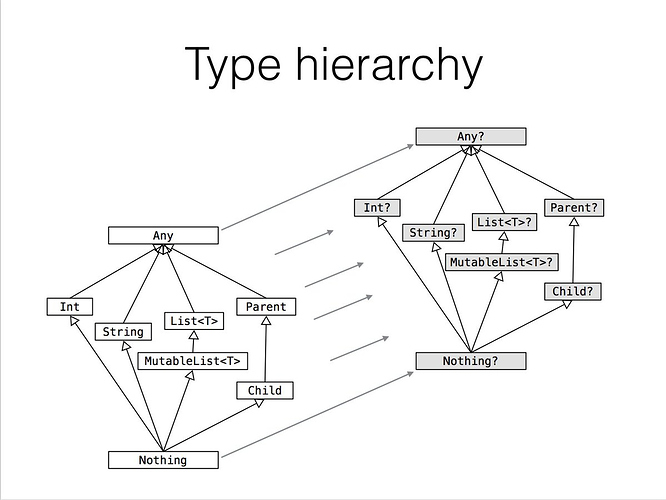

# 6장. 코틀린의 타입 시스템

코틀린에서는 `nullable 타입(널 허용)` 과 `immutable 타입(읽기 전용)`이 별도로 존재한다.

----

## Null 가능성

- NPE(Null Pointer Exception) 은 수많은 기간동안 개발자들을 괴롭혀온 버그이다.
- 코틀린을 비롯한 최신 언어들은 Null을 컴파일 시점에 확인할 수 있게 제공해준다.

`Java code`

```java
// 해당 코드는 NPE에 안전할까? string == null 이라면?
public class Main() {
    int strLen(String string) {
        return s.length;
    }
}
```

<br>

### 📌 Null Safe Type

- 보통의 경우 null 을 사용하는건 안티패턴이지만, 코틀린에서는 사용해도 괜찮다.
- 코틀린의 nullable 타입과 스마트 캐스팅등을 이용하여 Null을 안전하게 사용할 수 있다.

```kotlin
// Tip. 타입이 맞지않으면 컴파일 시점에 Type Mismatch 에러가 발생한다.
fun foo(): String = "foo"
fun bar(): String? = "bar"
```

<br>

- 이를 자바로 변환하면 아래와 같다. `Optional`을 사용하는게 아니라서 성능에 큰 영향 없다.

```java
/**
 * 이는 자바와 바이트코드상으로 @Nullable 어노테이션을 사용하는 것과 같다. 
 * Optional 이 아니다.
 */
public class Main {
    @NotNull
    public static final String foo() {
        return "foo";
    }

    @Nullable
    public static final String bar() {
        return "bar";
    }
}
```

<br>

----

## 코틀린에서 제공하는 연산자들

### 📌 Safe Call [ _?._ ]

- 아래 코드를 코틀린에선 연산자 ?. 를 이용하면 간단하게 처리할 수 있다.

```java
if(s!=null)
        s.toUpperCase()
        else
        null
```

```kotlin
// kotlin ?.
s?.toUpperCase()
```

<br>

- 객체 그래프를 탐색해야할 때 굉장히 간결하게 코드를 만들 수 있다.

```java
if(person!=null)
        if(person.house!=null)
        if(person.house.cat!=null)
        person.house.cat
        else null // person == null 이면 널 반환
        else null // person.house == null 이면 널 반환
        else null // person.house.cat == null 이면 널 반환
```

```kotlin
// kotlin ?.
val cat: Cat? = person?.house?.cat
```

<br>

### 📌 Elvis Operator [ _?:_ ]


```java
다른 언어에서 사용하던[Null coalescing]널 복합연산자 라는 이름이 있지만
        용어가 어렵기도 하고,엘비스 프레즐리의 머리스타일을 닮아 엘비스 연산자라고 많이 부른다.
```

- Null 이 반환되었을 때 동작을 하고싶다면, 엘비스 연산자를 사용하자.

```kotlin
val cat: Cat? = person?.house?.cat ?: DefaultCat()

val contents: List<Content> = response.data ?: emptyList()

// 꼭 반환값을 적을 필요는 없다. (아래의 경우 result 에는 Nothing 타입이 들어간다)
val content: Content = service.getContentByName(name)
    ?: throw Exception("컨텐츠의 이름이 잘못되었습니다.")
```

<br>

### 📌 is as as?

코틀린에서는 타입캐스팅을 하고 싶다면 연산자 as 를 사용하면 된다.

```kotlin
val person: Person = o as Person // 변환 실패시 ClassCastException 발생

val person: Person? = o as? Person // 변환 실패시 null 반환
    ?: return false // 이렇게 엘비스 연산자와 함께 사용가능
```

<br>

타입을 캐스팅하는 것이 아니라, 단순이 검사하고 싶다면 is 를 사용하면 된다.  
단, 코틀린 컴파일러는 스마트 캐스팅을 지원하기에 아래와 같이 사용할 수 있다.

```kotlin
if (o is Person) {
    // 해당 영역안에는 o 는 무조건 Person 이기 때문에, 컴파일러가 자동을 캐스팅해준다.
    println(o.name) // Person.name 사용 가능
}
```

<br>

### 📌 Null assertion [ _!!_ ]

- 위의 `?.` Safe Call 과 비슷하지만, 이는 null이 반환되면 `NullPointerExcetion` 발생시킨다.
- 사용을 권장하기 않기에 일부러 코드 가독성을 망치는 `!!` 를 사용한다고 한다.
  ```kotlin 
  val str: Stirng = s!!
  val cat: Cat = person!!.house!!.cat!! // null이라면 NPE 발생
  ```

다만 아래와 같이 어쩔 수 없는 경우도 있기에 이를 제공한다.

- 이미 다른 곳에서 Null 검사를 마쳤지만 코틀린 컴파일러는 알 수 없는 경우
- 코틀린 코드가 아닌 라이브러리를 사용하는 경우 `ex) Java Class`

<br>

----

## Scope Function 과 함께 사용하기 [ _let apply run also with_ ]

사실 `let` 으로 모든 기능을 구현해도 상관없으나, 이름에 맞게 사용하면 가독성이 올라간다.

<br>

### 📌 `*.let` (x -> x)  그대로 전달받고, 내가 원하는 값을 반환

가장 흔하게 쓰는 형태로, 기존 반환값을 함수 체이닝하여 사용할 떄 유용하다.

```kotlin
numbers.map { it.length }
    .filter { it > 3 }
    .let { println("num: $it") }
//.let(::println)
```

```kotlin
contentService.getContent(Id)
    ?.let(ContentDto::fromEntity)
    ?: throw EntityNotFoundException()
```

<details markdown="1">

<summary>  <b> [Click] run 함수 정의 살펴보기</b> </summary>

```kotlin
inline fun <T, R> T.let(block: (T) -> R): R {
    return block(this)
}
```

</details>

<br>
<br>

### 📌 `*.run` (this) 그대로 전달받고, 내가 원하는 값을 반환

run 이라는 이름에 맞게 이미 만들어진 객체를 수정하면서 반환할 때 적절하다.

```kotlin
val person = Person("name", 23)

val nextAge = person.run {
    ++age // person.age += 1
}
```

다만 run 의 경우, 객체를 생성할 때 아래와 같이 사용하기도 한다.

```kotlin
// 이렇게 객체를 생성할 때 사용하여 가독성을 높여 줄 수 있다.
val person = run {
    val name = "H43RO"
    val age = 23
    Person(name, age)  // Return
}
```

<details markdown="1">

<summary>  <b> [🎯Click] run 함수 정의</b> </summary>

```kotlin
fun <R> run(block: () -> R): R

inline fun <T, R> T.run(block: T.() -> R): R {
    return block()
}
```

</details>

<br>
<br>

### 📌 `*.also` (x -> x) 그대로 전달받고, 반환 안함 (원본 객체 반환)

also 라는 이름에 맞게 객체의 값을 수정하지 않고 부가적인 작업을 할 때 적절하다.  
또는 디버그-로깅등 부가적인 목적으로 사용할 때도 나쁘지 않다.

```kotlin
val numbers = mutableListOf("one", "two", "three")
numbers
    .also { println("new one: $it") }
    .add("four")
```

<details markdown="1">

<summary>  <b> [🎯Click] also 함수 정의</b> </summary>

```kotlin
inline fun <T> T.also(block: (T) -> Unit): T {
    block(this)
    return this
}
```

</details>


<br>
<br>

### 📌 `*.apply` (this) 그대로 전달받고, 반환 안함 (원본 객체 반환)

apply 라는 이름에 맞게, 객체의 값을 설정할 때 사용하면 좋다.

```kotlin
val adam = Person("Adam").apply {
    age = 32
    city = "London"
}

println(adam)
```

<details markdown="1">

<summary>  <b> [🎯Click] apply 함수 정의</b> </summary>

```kotlin
inline fun <T> T.apply(block: T.() -> Unit): T {
    block()
    return this
}
```

</details>

<br>
<br>

### 📌 `with(*)` (this) 파라메타로 전달받고, 내가 원하는 값을 반환

non-null 인 객체만 사용가능하며, 파라메타가 보여서 아래와 제한된 컨텍스트 `{...}`안에 다른 함수를 호출할 때 사용하면 가독성이 좋아진다.

```kotlin
with(numbers) {
    println("'with' is called with argument $this")
    println("It contains $size elements") // this.size
}
```

```kotlin
fun fromEntity(content: Content): ContentDto =
    with(contentMeta) {
        // this.contentId, this.status, this.startAT
        ContentDto(contentId, status, startAt)
    }
```

<details markdown="1">

<summary>  <b> [🎯Click] with 함수 정의</b> </summary>

```kotlin
inline fun <T, R> with(receiver: T, block: T.() -> R): R {
    return receiver.block()
}
```

</details>

<br>

----

## 코틀린의 원시타입

코틀린에서는 자바와 다르게 래퍼타입(`Integer, Double`)이 존재하지 않는다.  
개발자는 코틀린에서 제공하는 타입만을 사용한다. 원시타입(`int, doulbe`) 최적화 여부는 컴파일러가 결정한다.

```kotlin
val i: Int = 1
val list: List<Int> = listOf(1, 2, 3) // listOf<Int>(1,2,3)
```

<br>

만약 원시타입에 null 이 들어갈 수 있다면, 아래와 같이 `Int?` 으로 사용하면 된다.

```kotlin
val age: Int? = null
```

<br>

### 📌 숫자 변환 - 자동변환 되지 않음

코틀린에서는 Long - Int - Double 등이 자동으로 캐스팅 되지 않는다.

```kotlin
val i = 1
val lo: Long = i // 타입이 다르므로 Error: type mismatch 가 런타임에 발생한다.
println(i == lo) // Compile Error: Op '==' cannot be applied to 'Int' and 'Long'
```

변환이 필요하다면 아래와 같이 명시적으로 호출해주어야한다.

```kotlin
val i = 1
val lo1: Long = i.toLong() // toLong()에서 변환에 실패한 경우 type mismatch 가 발생한다.
val loNull: Long? = i.toLongOrNull() // 변환에 실패한 경우 null 을 반환한다.
```

<br>

### 📌 any (`자바의 object`)

코틀린에서 모든 객체는 Any 를 상속받는다. `자바의 Object와 같다.`

```kotlin
val greeting: Any = "Hello, World!"
```

```java
// java 로 변환 시
public final Object greeting="Hello, World!"
```

<br>

### 📌 Unit 과 Nothing (`자바의 void`)

코틀린에서 void는 존재하지 않고, `Unit` 타입이 존재한다.  
`Unit`은 함수가 정상적으로 종료됨을 의미하며 함수에서 아무것도 반환하지 않으면 Unit 타입이 반환된다.

```kotlin
fun returnsUnit(): Unit {
}

fun returnsUnitExplicitly(): Unit {
    return
}

fun returnsUnitExplicitly(): Unit {
    return Unit
}
```

```java
// java 로 변환 시
public final void returnsUnit(){
        }

public final void returnsUnitExplicitly(){
        return;
        }
```

<br>

코틀린에서는 특이하게 `Unit` 과 비슷한 `Nothing` 타입이 별도로 존재한다.   
`Nothing`은 **✨모든 타입의 서브클래스**가 될 수 있으며 개발자가 직접 생성할 수는 없다.


`Nothing` 은 개발자가 따로 사용하지 않더라도, 아래와 같은 상황에서 반환된다.

- 함수가 종료되지 않고 중간에 예외를 던질 경우
  ```kotlin
  fun throwException(): Nothing {
      throw IllegalStateException()
  }
  ```
- 함수가 종료되지 않고 무한 루프를 도는 경우
  ```kotlin
   fun infiniteLoop(): Nothing {
       while (true) {
        println("Hi there!")
    }
  }
  ```

- 만약 함수의 반환값이 nullable `fun hi(): Boolean?` 인 경우, 위의 상황에서 `Nothing?`이 반환된다.
  ```kotlin
  fun mayThrowAnException(throwException: Boolean): Boolean? {
      return if (throwException) {
          throw IllegalStateException() // Nothing? 반환
      } else {
          println("Exception not thrown :)")
          null // Boolean? 반환
      }
  }
  ```

<br>

- 이렇게 Nothing 타입을 별도로 둔 이유는, 코틀린에서는 아래와 같이 구문이 아닌 식(`Expression`)을 사용하는 경우가 많기 때문이다.
  ```kotlin
  val a = if(isBook()) "book" else "item" // if-else 를 식으로 사용 
  fun sum(a:Int, b:Int) : Int = a + b // 함수를 식으로 선언
  ```

- 이럴 때 식(`Expression`)에서 예외가 터진 경우, 할당하는 값에 `Nothing`타입을 넣어서 컴파일 예외를 명시적으로 만들어주는 용도이다.
  ```kotlin
  val value: Int = nullableValue?.toInt() ?: return // value 는 Nothing 타입이 될 수 있다.
  ```

<br>

---

## 컬렉션과 배열


코틀린에서는 기본적으로 불변 컬렉션을 사용하고, 가변 컬렉션은 Mutable을 붙여 사용한다.

| 컬렉션  | 읽기전용   | 변경가능                                              |
|------|--------|---------------------------------------------------|
| List | listOf | mutableListOf, arrayListOf                        |
| Set  | setOf  | mutableSetOf, hashSetOf, linkedSetOf, sortedSetOf |
| Map  | mapOf  | mutableMapOf, hashMapOf, linkedMapOf, sortedMapOf |

<br>

```kotlin
val list: List<Any> = listOf(1, 2, 3, "String") // list 는 불변이다. add 가 없다.

val mutableList: List<Any> = mutableListOf(1, 2, 3, "String")
mutableList.add("3") // 가능
```
* 불변이라고 생각하고 사용해도 전혀 문제없지만, 엄밀히 따지면 이는 코틀린 컴파일러에서 막아주는 것이고, 실제 리스트의 값이 불변하지는 않다.
  ```
  정확히 따지자면 setter 만 제거한 것이라고 볼 수 있다. 
  하지만 코틀린 컴파일러가 막아주기에 개발자는 신경쓰지 않고 불변 리스트로 사용해도 된다.
  이는 JDK 8 이전에는 바이트 코드에서 제공하는 불변리스트 `ex) List.of()` 가 존재하지 않았기 때문인데, 추후에 버전이 업그레이드되며 진짜 불변으로 변경될 수도 있다.
  ```
  
